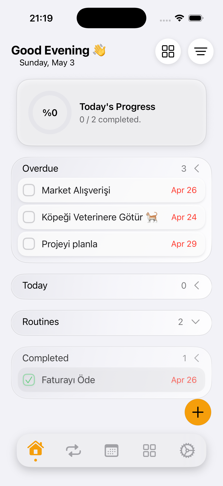
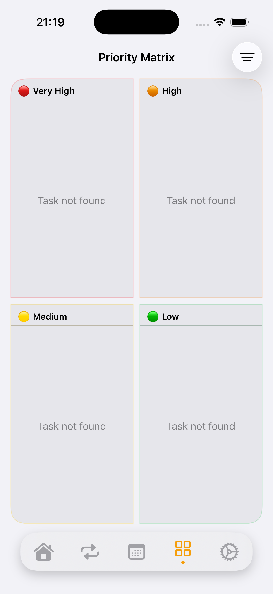
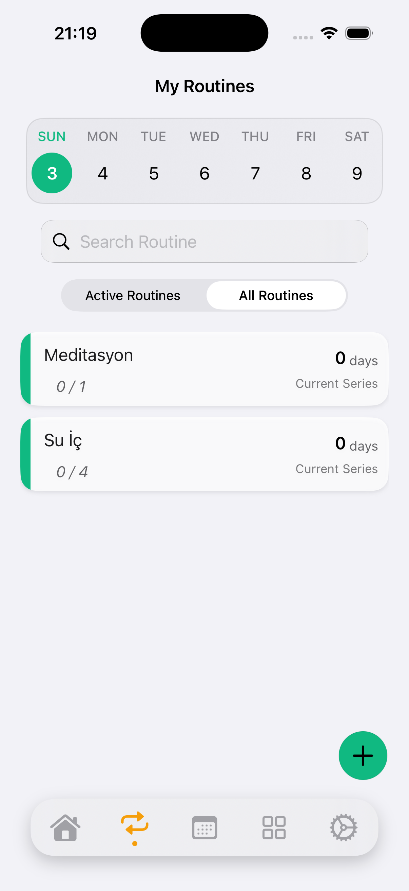
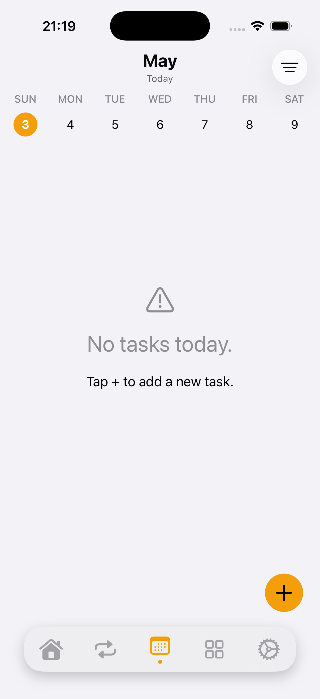

<div align="center">

# 🪺 DailyNest

### *Gününü Planla. Rutinini Kur. Önceliğini Bil.*


**DailyNest**, günün akışını üç katmanda düşünen modern bir iOS üretkenlik uygulamasıdır:
**tek seferlik görevler**, **tekrar eden rutinler** ve **Eisenhower önceliklendirme matrisi**.
SwiftUI + SwiftData + `@Observable` üzerine, sıfırdan **MVVM + Constructor DI** mimarisiyle kuruldu.

</div>

---

## 📱 Ekran Görüntüleri

<div align="center">

| Ana Sayfa | Eisenhower Matrisi |
|:---:|:---:|
|  |  |
| **Rutinler** | **Ajanda** |
|  |  |

</div>

---

## ✨ Öne Çıkan Özellikler

### 🗓 Akıllı Ana Sayfa
Yatay kaydırılabilir takvim, günlük dairesel ilerleme kartı ve seçili güne ait görev/rutin bölümleri tek ekranda.

### 📊 Eisenhower Öncelik Matrisi
Görevleri **Acil/Önemli** ekseninde dört kadrana yerleştir; gerçek zamanlı sürükle-bırak ve filtreli görünüm.

### 🔁 Çok Adımlı Rutin Kurulumu
`RoutineSheet` ile **temel bilgi** ve **zamanlama** adımlarına bölünmüş kurulum akışı; günlük log (`RoutineDailyLog`) ve hedef (`RoutineGoal`) takibi.

### 📅 Ajanda Görünümü
Tüm günlük görevleri tarihe göre listele, hızlıca gez.

### 🎨 Modern UI Dili
Glassmorphism efektli floating tab bar, gradient arka planlar, akıcı geçişler.


---

## 🏛 Mimari

DailyNest, **MVVM + Constructor Dependency Injection** üzerine **feature-based** klasör yapısıyla kurulmuştur.
Tüm Service ve Settings'ler `DailyNestApp.init` içinde oluşturulup `.environment()` ile inject edilir;
View'lar bunlara `@Environment(...)` aracılığıyla erişir.

### Veri Akışı

```
┌────────┐     ┌───────────┐     ┌──────────┐     ┌────────────┐     ┌─────────────┐
│  View  │ ──▶ │ ViewModel │ ──▶ │ Service  │ ──▶ │ Repository │ ──▶ │ SwiftData   │
└────────┘     └───────────┘     └──────────┘     └────────────┘     │ ModelContext│
                                                                     └─────────────┘
```

View hiçbir zaman `ModelContext`'e doğrudan dokunmaz. Repository veriyi getirir, Service iş mantığını yürütür, ViewModel sunum durumunu yönetir.

### Klasör Yapısı

```
DailyNest/
├── App/                   # @main entry point + TabBar
├── Core/
│   ├── Models/            # SwiftData @Model'leri (DailyTask, Routine, Project, ...)
│   ├── Repositories/      # ModelContext'e tek erişim noktası
│   ├── Services/          # İş mantığı (DailyTaskService, RoutineService, ProgressCalculator)
│   └── Settings/          # @Observable kullanıcı ayarları
├── Features/              # Her feature: View + ViewModel (+ Components/, Sheets/)
│   ├── MainPage/
│   ├── Agenda/
│   ├── PriorityMatrix/
│   ├── Routines/
│   ├── DailyTask/
│   └── Settings/
├── Shared/                # Ortak Component'ler ve Utility'ler
├── Theme/                 # ColorPalette, Background, Extension'lar
└── Resources/             # Assets, MockData
```

---

## 🛠 Teknoloji Yığını

| Katman | Teknoloji |
|---|---|
| UI | **SwiftUI** (iOS 17+) |
| Veri | **SwiftData** — `@Model`, `@Query`, `ModelContext` |
| State | **`@Observable`** makrosu (ObservableObject **değil**) |
| DI | Constructor Injection + `.environment()` |
| Ayarlar | `@AppStorage` + `@Observable` Settings sınıfları |
| Mimari | MVVM + Repository/Service ayrımı |


---

## 🗺 Yol Haritası

- [x] MVVM + Constructor DI mimarisine geçiş
- [x] Feature-based klasör yapısına refactor
- [x] Eisenhower Matrisi (`PriorityMatrixView`)
- [x] Çok adımlı Rutin kurulum sheet'i
- [ ] **Project / ProjectTask** feature'ı (modeller hazır, UI bekleniyor)
- [ ] Bildirim & hatırlatıcı entegrasyonu
- [ ] Widget desteği
- [ ] iCloud sync (CloudKit)
- [ ] Test target

